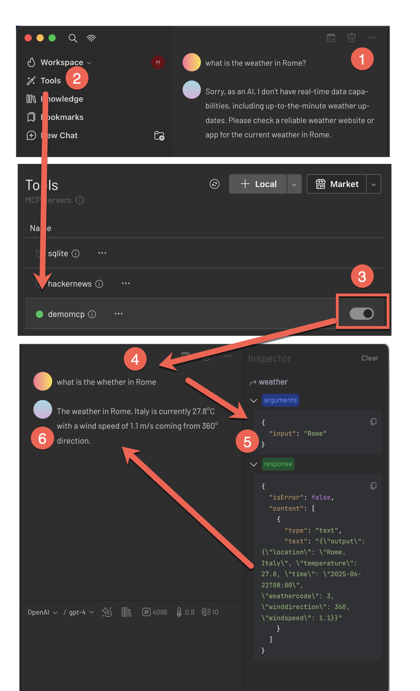

#  olaris-mcp

This is An ops plugin to create  MCP servers with Apache OpenServerless.

This plugin allows to write an MCP server in a serverless way, just writing functions and publishing them to OpepServerless.

The plugin can be run locally or deployed in a server.

Important: a single mcp server is equivalent to a package`. An MCP server is actually a collection of tools, prompts and resources. Each of those is equivalent to a diffent OpenServerless function.

# Installation

This is a `ops` plugin and can be installed with:

```
ops -plugin https://github.com/mastrogpt/olaris-mcp
```

You can also install locally with:

```
git clone https://github.com/mastrogpt/olaris-mcp
```

Test it has been installed properly with `ops mcp` and ensure you see the synopsis

```
Usage:
 mcp new <package> [<description>] (--tool=<tool>|--resource=<resource>|--prompt=<prompt>|--clean=<clean>) [--redis] [--postgres] [--milvus] [--s3]
 mcp run <package> [--sse]
 mcp generate <package>
 mcp test <package> [--sample] [--norun]
 mcp install [<package>] [--cursor] [--claude] [--5ire] [--uninstall]
 mcp inspect <package>  [--sse] 
 mcp sse <package> [<hostname>] [--uninstall]
```

As you can see you can do:

- `ops mcp new` to  create a new `--tool` or a `--promot` or a  `--resource` in a package 
- `ops mcp run` to  run a package as mcp sever
- `ops mcp test` to test the generated mcp server with cli
- `ops mcp install`  to  install/uninstall local mcp server to cursor / claude / 5ire
- `ops mcp inspect`  to run the  start the MCP web inspector 

# Create a new MCP server

Let's go through the steps to create a simple MCP server, for example one providing wheather informations for any place in the world.

We will create for this a serverless function that can act as a Proxy.

```
ops mcp new demomcp --tool=weather
```

Now you have to provide meta data informations describing your MCP tool with annotations as follows:

```
#-a mcp:type tool
#-a mcp:desc "Provide whether information for a given location"
#-a input:str "the location to get the weather info for"
```

## Implementing a wheather function

Now you can implement the logic or your wheater function

Of course you can use AI to quicky generate your code. For example you can use the following prompt to quickly get a function that retrieves the wheater informatons:

  A python function `get_wheater(location)`,  using `requests` and `open-meteo.com` that will retrieve the location provided in input, consider the first location returned, then ask and return return wheather informations at that location.

I am not including the function here but ChatGPT generally returns a proper implementation you can use.

Hence you can write the following code to invoke it:

```
def weather(args):
  inp = args.get("input", "")
  out = f"Please provide a location to get the weather information for."
  if inp != "":
    out = get_wheater(inp)
  return { "output": out }
```

Deploy the function and test is as follows:

```
$ ops ide deploy demomcp/weather
ok: updated action demomcp/weather
$  ops invoke demomcp/weather 
{
    "output": "Please provide a location to get the weather information for."
}
$ ops invoke demomcp/weather input=Rome
{
    "output": {
        "location": "Rome, Italy",
        "temperature": 26.0,
        "time": "2025-06-22T06:45",
        "weathercode": 2,
        "winddirection": 360,
        "windspeed": 2.9
    }
}
$ ops invoke demomcp/weather input=NotExitingCity
{
    "output": "Could not find location: NotExitingCity"
}
```

# Testing the  MCP Server

Your MCP server is now basically ready, and you can test it with the graphical inspector using:

```
ops mcp inspect demomcp
```

The inspector allows to connect to the MCP server, list tools and resources and test the behaviour.


In the image you can see what happens when you invoke the tool `wather` to see the wheater in Rome.

# Using the MCP Server

Now it is all ready to actually use the MCP server in any Chat user interface able to use an MCP server.

In this example we use [5ire](https://5ire.app/) a free AI Assistant and MCP client that is an excellent host to run MCP Servers.

You can install your MCP server using our `ops` cli. Check our [installation](https://openserverless.apache.org/docs/installation/download/) page to learn how to install it.

Once you have installed, the whole MCP server management is a plugin you can install with

```
ops -plugin https://github.com/mastrogpt/olaris-mcp
```

You can install the MCP server developed as functions in 5ire in two steps.

First you have to login to your Apache OpenServerless accout with:

```
ops ide login
```

Then you can install in 5ire with the command

```
ops mcp install demomcp --5ire
```

All done! Now access your 5ire client. 

# Testing things out

Let's test step by step our tool to check weather infomations.



Step 1: if you ask to any chatbot for example the Weather in Rome, it will tell you that as a LLM is pretrained, he does not know

Step 2: Let's open the list of availabe tools.

Step 3: Here you can see all the available toos, our tool is `demomcp`, let's enable it.

Step 4: Now the selected LLM wil be avale of the available tools, so just ask about the whater in Rome

Step 5: You can see here what happens under the hood: it will invoke the MCP server that will in turn invoke the serverless functions and ask for the weather.

Step 6. Success! Now you have extended your LLM to provide dynamic information sbaout the wheter everywhere in the world.


